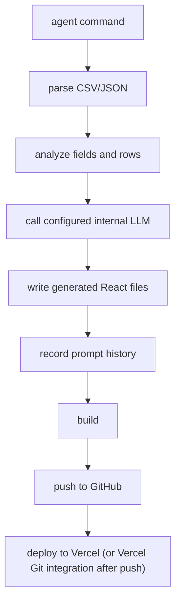

# Agent Automation Contract

## Quickstart (60 seconds)

```bash
# 1. One-time human setup (LLM provider + GitHub + Vercel + dashboard login):
openboard           # interactive TUI, follow the setup wizard

# 2. Create a dashboard from a data file:
openboard agent create --data "./data/uber_rides.csv" --name "Uber Rides" --json

# 3. Update it later with a prompt (selector comes from step 2 output):
openboard agent update --dashboard "uber-rides" --prompt "Add a monthly trend chart" --json
```

Parse stdout JSON for `success`, `dashboardSelector`, `deployUrl`, and `errorCode` on failure. Progress streams to stderr.

---

This file is for automation agents, scheduled jobs, and cron-style tools that need to create or update OpenBoard dashboards without opening the interactive TUI.

OpenBoard owns the complete workflow:



## Prerequisites

OpenBoard must be configured once by a human:

- LLM provider: OpenAI API key, OpenAI Codex login, Anthropic, Moonshot, or Ollama.
- GitHub token or authenticated GitHub CLI.
- Vercel token or Vercel Git integration.
- Dashboard login credentials.

Install from npm (the package is `openboard-cli`; the installed command is `openboard`):

```bash
npm install -g openboard-cli
```

Check installation:

```bash
node --version
git --version
openboard --version
```

From source, use `node dist/index.js` instead of `openboard` after building:

```bash
npm install
npm run build
node dist/index.js --help
```

## Create Dashboard

Use this when the agent has a new CSV/JSON data source and wants OpenBoard to add a new tab to the shared dashboard app.

```bash
openboard agent create --data "<csv-or-json-path>" --name "<dashboard title>"
```

Full form:

```bash
openboard agent create \
  --data "./data/uber_rides.csv" \
  --name "Uber Rides" \
  --type custom \
  --prompt "Create an operations dashboard with trip volume, fare trends, distance trends, and pickup location breakdowns."
```

PowerShell:

```powershell
openboard agent create --data ".\data\uber_rides.csv" --name "Uber Rides" --type custom --prompt "Create an operations dashboard with trip volume, fare trends, distance trends, and pickup location breakdowns."
```

`onboard` is an alias for `create`:

```bash
openboard agent onboard --data "./data/uber_rides.csv" --name "Uber Rides"
```

Flags:

| Flag | Required | Meaning |
|---|---:|---|
| `--data` | yes | CSV/JSON file path |
| `--name` | no | Dashboard title; derived from file name if omitted |
| `--type` | no | `health`, `finance`, `grocery`, or `custom`; default `custom` |
| `--prompt` | no | Intent for the initial dashboard |
| `--json` | no | Final result as JSON on stdout; progress logs on stderr |

Success output includes:

```text
Created dashboard: Uber Rides
Dashboard selector: uber-rides
Deployment: https://...
```

Save the dashboard selector for later updates.

## Update Dashboard With Prompt

Use this when an agent has a user request for an existing dashboard.

```bash
openboard agent update --dashboard "<selector>" --prompt "<user request>"
```

Example:

```bash
openboard agent update --dashboard "uber-rides" --prompt "Add a weekday vs weekend chart and highlight unusually expensive rides."
```

Use a refreshed data file for this update:

```bash
openboard agent update --dashboard "uber-rides" --data "./latest/uber_rides.csv" --prompt "Refresh all metrics and add a city breakdown."
```

Flags:

| Flag | Required | Meaning |
|---|---:|---|
| `--dashboard` | yes | Dashboard id, slug/name, or exact title |
| `--prompt` | yes | User instruction for UI/code changes |
| `--data` | no | Override the dashboard's linked data file for this run |
| `--json` | no | Final result as JSON on stdout; progress logs on stderr |

## Modify All Dashboards With One Prompt

Apply a single instruction to every registered dashboard, then build/push/deploy the shared app once:

```bash
openboard agent update --all --prompt "Add a footer showing the last data refresh time"
```

Each dashboard is regenerated from its own linked data with the same prompt; dashboards with no linked data source are skipped. Equivalent non-agent form: `openboard update --all --prompt "..."`.

## Remove All Dashboards

Remove every dashboard at once. The generated app is reset to the empty OpenBoard shell (auth, brand logo, and theme toggle preserved), all dashboard components + protected data are deleted, the registry is cleared, and the app is redeployed once. The workspace folder and GitHub/Vercel project are kept.

```bash
openboard agent remove --all --json
```

`--all` is required — there is no single-dashboard `agent remove` (use the TUI for that, or it stays a deliberate bulk-only operation).

## Refresh From Saved Prompt History

Use this when the data source file has changed and the same dashboard intent should be regenerated without a new user prompt.

```bash
openboard update --dashboard "<selector>"
```

Refresh all registered dashboards:

```bash
openboard update --all
```

This relies on local prompt history stored per dashboard. It works after a dashboard has had at least one successful initial generation or prompt update.

## Query Commands

```bash
openboard agent list --json                          # all dashboards + deploy URLs + data staleness
openboard agent status --dashboard "uber-rides" --json   # one dashboard, incl. dataStale flag
openboard agent runs --json                          # recent pipeline runs + failure summary
```

`agent status` reports `dataStale: true` when a linked data file changed after the last generation — use it to decide between `openboard update --dashboard <selector>` (refresh) and doing nothing.

## Dry Run

Validate intent cheaply before paying for generation:

```bash
openboard agent create --data "./data/uber_rides.csv" --name "Uber Rides" --dry-run --json
```

Returns a `plan` (title, selector, type, rowCount, columnCount, dataSummary) without calling the LLM, writing files, or deploying.

## Idempotency

Pass `--idempotency-key <key>` to `agent create`. If a previous run with the same key succeeded, OpenBoard returns that run's result (`"reused": true`) instead of creating a duplicate dashboard. Use this when your orchestrator retries on timeout.

## Resume

Every create/update run persists state under `~/.openboard/runs/`. If a run fails after generation succeeded (e.g. build or deploy failed), resume re-runs only the build → push → deploy → verify tail — no LLM cost:

```bash
openboard agent runs --json                # find the failed runId
openboard agent resume <run-id> --json
```

## Rollback

Each successful deploy tags the generated repo (`deploy-N`). Roll back to the previous deploy and redeploy it:

```bash
openboard rollback --dashboard "uber-rides"
openboard agent rollback --dashboard "uber-rides" --json
```

## JSON Mode

Use `--json` for reliable machine parsing. Final result JSON goes to stdout; structured NDJSON progress events stream to stderr, one JSON object per line:

```json
{"event":"phase","phase":"generate","pct":8,"message":"Generating dashboard code"}
{"event":"log","message":"  codex still generating… 30s elapsed","phase":"generate","pct":12}
{"event":"result","success":true,"pct":100}
```

Track `phase` + `pct` for progress UIs; a phase that stops emitting `log` events for several minutes is wedged.

```bash
openboard agent create --data "./data/uber_rides.csv" --name "Uber Rides" --json
openboard agent update --dashboard "uber-rides" --prompt "Add trend charts" --json
```

Success shape:

```json
{
  "success": true,
  "action": "update",
  "dashboard": "Uber Rides",
  "dashboardSelector": "uber-rides",
  "projectDir": "projects/openboard-app-workspace-...",
  "deployUrl": "https://example.vercel.app",
  "deployTag": "deploy-4",
  "verified": true,
  "runId": "run-2026-06-10-ab12cd34",
  "tokenUsage": { "promptTokens": 5200, "completionTokens": 3100, "estimated": false },
  "writtenFiles": ["App.tsx", "components/UberRidesDashboard.tsx"]
}
```

`verified` is the post-deploy health check (app shell + auth API respond at the deploy URL). `verified: false` means the deploy completed but the URL is not yet healthy — re-check before reporting success to a user.

Failure shape:

```json
{
  "success": false,
  "action": "update",
  "dashboardSelector": "uber-rides",
  "runId": "run-2026-06-10-ab12cd34",
  "error": "Dashboard not found: uber-rides",
  "errorCode": "E_DASHBOARD_NOT_FOUND",
  "writtenFiles": []
}
```

## Error Codes

Branch on `errorCode`, never on the prose `error` string:

| Code | Meaning | Suggested agent action |
|---|---|---|
| `E_VALIDATION` | Missing/invalid flags | Fix the command |
| `E_DATA_NOT_FOUND` | Data file missing | Check the path |
| `E_DATA_PARSE` | Data file unparseable | Check the file format |
| `E_DASHBOARD_NOT_FOUND` | Unknown selector | `agent list` to discover selectors |
| `E_NO_LLM` | No LLM configured | Ask a human to run setup |
| `E_LLM_QUOTA` | LLM quota/credits/rate limit exhausted | Wait for the limit to reset, top up billing, or switch providers; do not hammer-retry |
| `E_LLM_EMPTY` / `E_LLM_FAILED` | Generation failed | Retry once, then escalate |
| `E_SCAFFOLD_FAILED` / `E_INSTALL_FAILED` | Workspace setup failed | Escalate |
| `E_BUILD_FAILED` | Build failed after self-repair attempts | `agent resume <runId>` retries build only |
| `E_PUSH_FAILED` | Git push failed | Check GitHub auth |
| `E_DEPLOY_AUTH` | Vercel auth missing | Ask a human to re-auth |
| `E_DEPLOY_FAILED` | Deploy failed | `agent resume <runId>` |
| `E_VERIFY_FAILED` | Deployed but URL unhealthy | Re-check the URL later |
| `E_LOCKED` | Another run holds the project lock | Wait and retry |
| `E_RUN_NOT_FOUND` | Bad run id for resume | `agent runs` to list ids |
| `E_UNKNOWN` | Unclassified | Read `error`, escalate |

Build failures trigger an automatic self-repair loop (up to 2 LLM repair passes) before `E_BUILD_FAILED` is returned.

## Exit Codes

| Exit code | Meaning |
|---:|---|
| `0` | Command completed successfully |
| non-zero | Command failed; read stderr/stdout |

Common failures:

```text
Missing required --data <csv|json> for agent create.
Missing required --dashboard <id|name|title> for agent update.
Missing required --prompt "..." for agent update.
Agent update failed: Dashboard not found: <selector>
Agent create failed: File not found: <path>
Agent create failed: No LLM provider configured. Configure LLM settings first.
```

## File Rules

Agents should not edit OpenBoard config, prompt-history, or generated app files directly unless explicitly asked.

OpenBoard stores:

```text
~/.openboard/config.json
~/.openboard/prompt-history/<dashboard-id>.json
~/.openboard/runs/<run-id>.json
projects/openboard-app-workspace-<id>/
projects/openboard-app-workspace-<id>/.openboard.lock   (present only while a run is active)
```

Always quote Windows paths:

```bash
openboard agent create --data "C:\Users\user\data\uber_rides.csv" --name "Uber Rides"
```

Do not prefix paths with `- `. Pass the raw path only.

## Agent Decision Rules

Use `openboard agent create` when:

- The user provides a new data file.
- There is no existing dashboard selector.
- A new tab should be added to the shared OpenBoard UI.

Use `openboard agent update` when:

- The user wants a UI change for an existing dashboard.
- The user provides a prompt, chart change, metric change, or refreshed data plus a new instruction.

Use `openboard update --dashboard` when:

- The data file changed.
- No new prompt is needed.
- The saved prompt history should drive regeneration.

Use `openboard update --all` when:

- Scheduled jobs refreshed multiple data files.
- All registered dashboards should be rebuilt/deployed.

Do not call `openboard` or `openboard start` from automation. Those start the interactive TUI.

## Smoke Tests

```bash
npm run lint
npm run build
node dist/index.js --help
node dist/index.js agent create
node dist/index.js agent update --dashboard test-dashboard
node dist/index.js agent update --dashboard definitely-missing --prompt "test prompt"
```

Expected validation errors:

```text
Missing required --data <csv|json> for agent create.
Missing required --prompt "..." for agent update.
Agent update failed: Dashboard not found: definitely-missing
```
