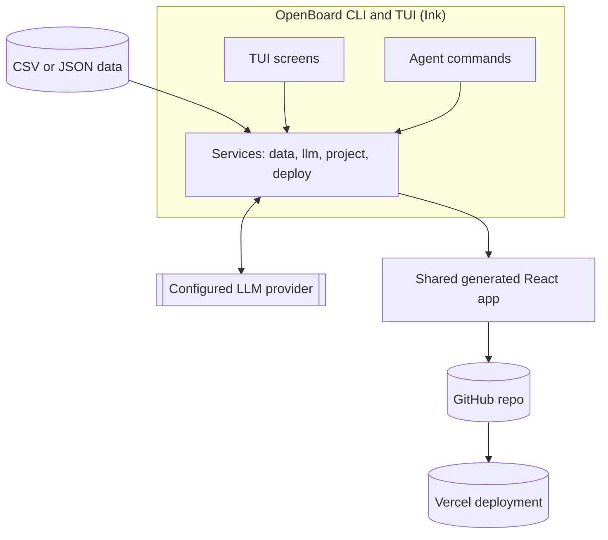
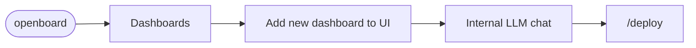
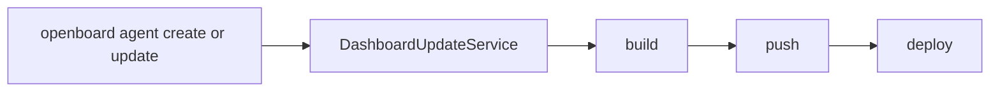
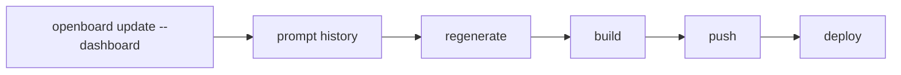
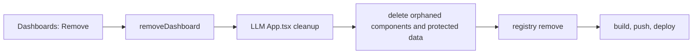
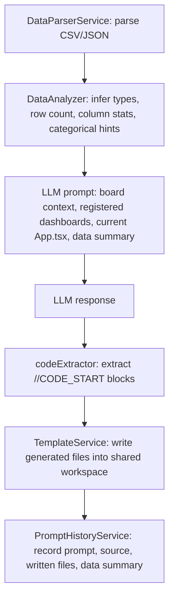
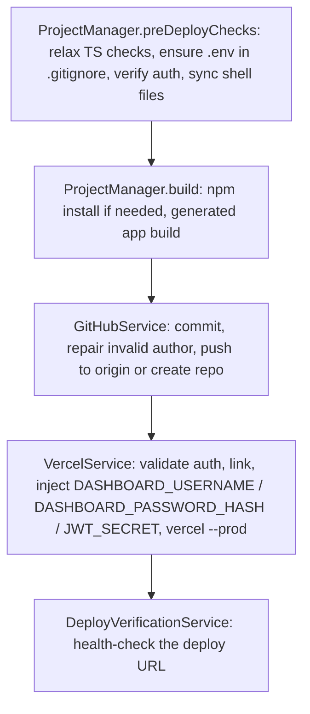

# OpenBoard Architecture

> Version: 1.0.6  
> Current branch: develop  
> Scope: OpenBoard TUI, non-interactive CLI, shared generated dashboard app

## Overview

OpenBoard is an Ink-based terminal application that generates one shared authenticated React dashboard app. The first dashboard creates the app workspace. Later dashboards are added as tabs in the same generated UI.



**Human TUI flow**



**Agent flow**



**Data refresh flow**



**Remove flow**



## Top-Level Modules

```text
src/
  index.tsx                         CLI entry point and non-interactive commands
  App.tsx                           TUI screen router
  theme.ts                          TUI color tokens
  constants/loadingRemarks.ts        Internal chat loading/header remarks
  screens/
    WelcomeScreen.tsx
    SetupWizard.tsx
    BoardCreationScreen.tsx
    ManageBoardsScreen.tsx
    ChatScreen.tsx
  components/
    ChatMessage.tsx
    LoadingRemark.tsx
    CodePreview.tsx
    Spinner.tsx
    ProgressBar.tsx
    StatusBadge.tsx
  services/
    auth/AuthService.ts
    build/BuildService.ts
    config/ConfigService.ts
    data/DataParserService.ts
    data/DataAnalyzer.ts
    deploy/GitHubService.ts
    deploy/VercelService.ts
    deploy/PreviewService.ts
    deploy/DeployVerificationService.ts
    llm/LLMService.ts
    llm/OpenAIProvider.ts
    llm/OpenAICodexProvider.ts
    llm/AnthropicProvider.ts
    llm/OllamaProvider.ts
    llm/MoonshotProvider.ts
    llm/prompts/systemPrompt.ts
    project/ProjectManager.ts
    project/BoardRegistryService.ts
    project/PromptHistoryService.ts
    project/DashboardUpdateService.ts
    project/RunStateService.ts
    project/ProjectLockService.ts
    project/pipelinePhases.ts
    template/TemplateService.ts
  utils/
    commandParser.ts
    codeExtractor.ts
    crossSpawn.ts
    errorCodes.ts
    logger.ts
templates/dashboard/
projects/
tests/
dist/
```

## CLI Entry Point

`src/index.tsx` uses `meow`.

Commands:

```bash
openboard
openboard start
openboard update --dashboard <selector>
openboard update --all
openboard rollback --dashboard <selector>
openboard agent create --data <file> --name <title> [--type custom] [--prompt "..."] [--json]
openboard agent update --dashboard <selector> --prompt "..." [--data <file>] [--json]
openboard agent list | status | runs | resume <run-id> | rollback [--json]
openboard --version
openboard --help
```

`openboard` and `openboard start` require an interactive TTY and render `App`.

`openboard update` and `openboard agent ...` are non-interactive and use `DashboardUpdateService`.

## TUI Screens

`App.tsx` routes screens:

```text
welcome
setup
manage-boards
create-board
chat
settings
settings-llm
settings-github
settings-vercel
settings-dashboard-auth
deploy
```

Important behavior:

- `manage-boards` is the outside dashboard menu.
- `create-board` collects preset, data file, and dashboard name.
- A newly created dashboard opens `ChatScreen` with `autoGenerateInitial=true`.
- Opening an existing dashboard opens `ChatScreen` with `autoGenerateInitial=false`, so it does not regenerate from scratch.

## TUI Theme

`src/theme.ts` centralizes OpenBoard TUI colors:

| Token | Value | Use |
|---|---|---|
| `logo` | `#C17F53` | Logo/accent/prompt |
| `border` | `#8B7355` | Borders and frames |
| `subtitle` | `#DCDCDC` | Subtitle/dim helper text |

This applies only to OpenBoard's terminal UI. The generated React dashboard UI is controlled by user prompts and LLM output.

## Internal Chat

`ChatScreen` provides the internal LLM workflow.

Header:

- New dashboard creation: `New Dashboard (<configured LLM>)`
- Existing dashboard: `<dashboard title> (<configured LLM>)`
- Second line: `Internal LLM chat for dashboard creation`
- Third line: a static random remark selected from `loadingRemarks.ts` when the screen opens

Message labels:

| Role | Label |
|---|---|
| user | `You` |
| assistant | `LLM` |
| system | `Sys` |
| error | `Err` |

While loading, `LoadingRemark` displays a compact spinner plus a rotating sarcastic one-liner. The line changes every 10 seconds and uses a fast subtle shimmer.

## Chat Commands

`src/utils/commandParser.ts` parses exact slash commands before text reaches the LLM.

| Command | Action |
|---|---|
| `/deploy` | Build, push, deploy |
| `/push` | Commit and push |
| `/preview` | Start or restart local preview |
| `/build` | Build generated app |
| `/update` | Regenerate using latest data and saved prompt history, then build/push/deploy |
| `/data` | Parse and summarize linked data source |
| `/history` | Show prompt history |
| `/logs` | Show latest operation log |
| `/doctor` | Show readiness checks |
| `/status` | Show project/dashboard status |
| `/config` | Open settings |
| `/commands` | Show command palette |
| `/help` | Show help |

Unknown slash commands and normal text are sent to the LLM as messages.

## Shared App Model

`ProjectManager` uses one shared workspace by default:

```text
projects/openboard-app-workspace-<id>/
```

`BoardRegistryService` tracks:

- registered dashboards
- shared project directory
- dashboard ids/names/titles/types
- linked data files

The generated app has one authenticated shell with multiple dashboard tabs. The LLM is instructed to preserve:

- `AuthProvider`
- `LoginPage`
- `useAuth`
- username/logout UI
- master `<h1 className="app-title">OpenBoard</h1>`
- existing tabs/components

## Prompt History

`PromptHistoryService` stores prompt history per dashboard:

```text
~/.openboard/prompt-history/<dashboard-id>.json
```

History is appended after successful LLM file writes. It powers:

- internal `/update`
- `openboard update --dashboard`
- `openboard update --all`

When a dashboard is removed, its prompt-history file is removed with it.

## LLM Providers

Providers implement the common `LLMProvider` interface:

```typescript
validate(): Promise<LLMValidationResult>
listModels(): Promise<string[]>
complete(options): Promise<string>
stream(options): AsyncIterable<LLMStreamChunk>
```

Supported providers:

| Provider | Auth |
|---|---|
| OpenAI | API key |
| OpenAI Codex | Browser/device login through official `codex` CLI |
| Anthropic | API key |
| Moonshot | API key |
| Ollama | Local host |

## Data And Generation Flow



## Deployment Flow



If GitHub push succeeds but direct Vercel CLI auth fails, OpenBoard reports that Vercel Git integration may still deploy the pushed commit.

## Config And Security

Config path:

```text
~/.openboard/config.json
```

Encryption:

- AES-256-GCM
- scrypt KDF
- `OPENBOARD_ENCRYPTION_SECRET` or generated machine secret

Environment variables:

| Variable | Purpose |
|---|---|
| `OPENBOARD_ENCRYPTION_SECRET` | Optional config encryption secret |
| `OPENBOARD_CONFIG_DIR` | Override config directory |
| `OPENBOARD_TEST_MODE` | Disable file logging in tests |
| `OPENBOARD_DEBUG` | Enable debug logging |
| `DASHBOARD_USERNAME` | Generated app login username |
| `DASHBOARD_PASSWORD_HASH` | bcrypt password hash |
| `JWT_SECRET` | Generated app JWT secret |

## Verification

```bash
npm run lint
npm run test:run -- tests\phase4\command-parsing.test.ts
npm run build
node dist\index.js --help
node dist\index.js agent create --json
node dist\index.js agent update --dashboard test-dashboard --json
```
