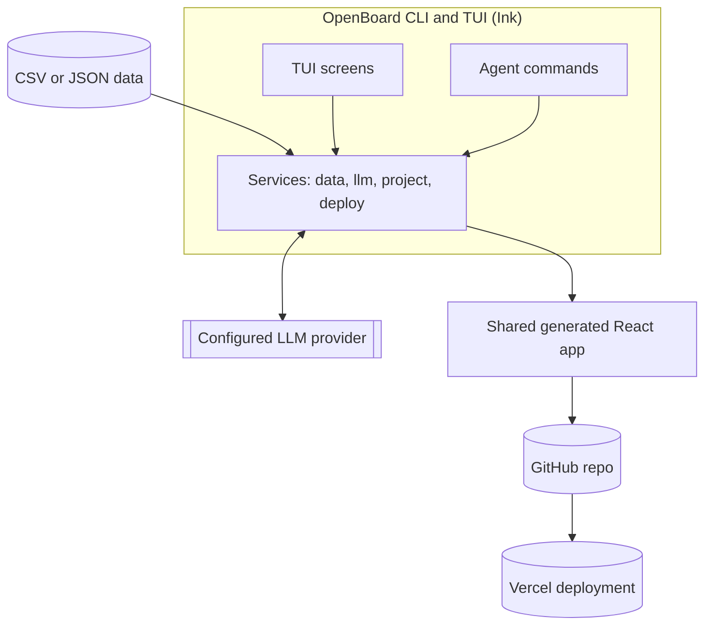
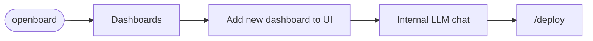
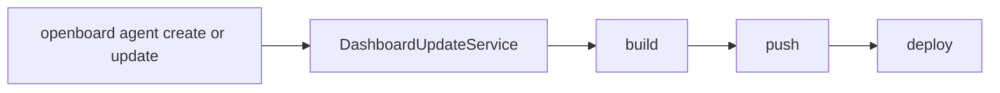
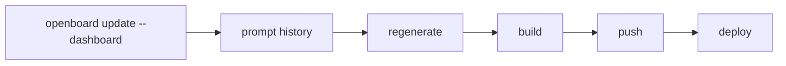
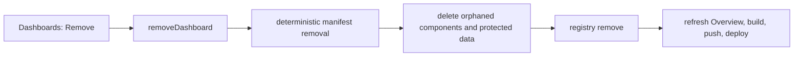
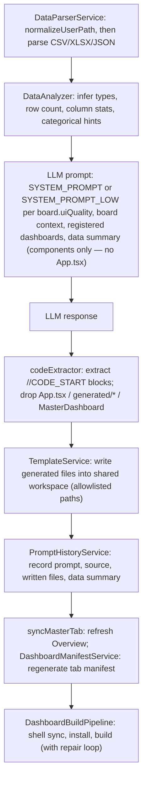
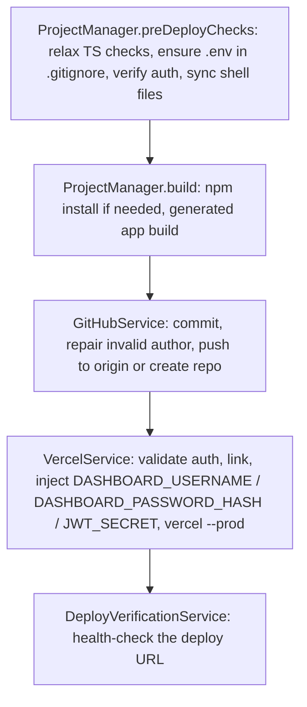
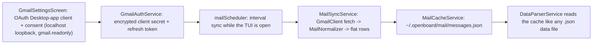

# OpenBoard Architecture

> Version: 1.6.0  
> Current branch: main  
> Scope: OpenBoard TUI, non-interactive CLI, shared generated dashboard app

## Overview

OpenBoard is an Ink-based terminal application that generates one shared authenticated React dashboard app. The first dashboard creates the app workspace. Later dashboards are added as tabs in the same generated UI.


```mermaid
flowchart TB
    subgraph OB["OpenBoard CLI and TUI (Ink)"]
        T[TUI screens]
        AG[Agent commands]
        S[Services: data, llm, project, deploy]
    end
    D[(CSV or JSON data)]
    L[[Configured LLM provider]]
    APP[Shared generated React app]
    GH[(GitHub repo)]
    V[(Vercel deployment)]
    D --> S
    T --> S
    AG --> S
    S <--> L
    S --> APP
    APP --> GH --> V
```

**Human TUI flow**


```mermaid
flowchart LR
    A([openboard]) --> B[Dashboards] --> C[Add new dashboard to UI] --> D[Internal LLM chat] --> E["/deploy"]
```

**Agent flow**


```mermaid
flowchart LR
    A["openboard agent create or update"] --> B[DashboardUpdateService] --> C[build] --> D[push] --> E[deploy]
```

**Data refresh flow**


```mermaid
flowchart LR
    A["openboard update --dashboard"] --> B[prompt history] --> C[regenerate] --> D[build] --> E[push] --> F[deploy]
```

**Remove flow**


```mermaid
flowchart LR
    A["Dashboards: Remove"] --> B[removeDashboard] --> C[deterministic manifest removal] --> D[delete orphaned components and protected data] --> E[registry remove] --> F[refresh Overview, build, push, deploy]
```

**Deterministic dashboard composition** (since the pipeline refactor): the LLM
owns individual dashboard components only. OpenBoard owns the application
shell, tab order, imports, and routing through the product-owned
`src/generated/dashboardManifest.tsx`, regenerated by
`DashboardManifestService` from the board registry before every build, preview,
and deploy (TUI and agent flows alike). `App.tsx`, the manifest, and
`MasterDashboard.tsx` in model responses are filtered out before writing.

## Top-Level Modules

```text
src/
  index.tsx                         CLI entry point and non-interactive commands
  App.tsx                           TUI screen router (first-run routes to setup)
  theme.ts                          TUI color tokens
  constants/loadingRemarks.ts        Internal chat loading remarks
  config/
    appModes.ts                     local / hybrid / remote mode contract
    llmCatalog.ts                   provider + model + effort catalog
    boardPresets.ts                 dashboard category presets
    dashboardPrompts.ts             per-category prompt tuning
  screens/
    WelcomeScreen.tsx
    SetupWizard.tsx
    setupWizardReducer.ts           pure wizard step state machine
    BoardCreationScreen.tsx
    ManageBoardsScreen.tsx
    ChatScreen.tsx
    GmailSettingsScreen.tsx
  components/
    ChatMessage.tsx
    LoadingRemark.tsx
    PipelineProgress.tsx            phase-weighted progress line
    CodePreview.tsx
    Spinner.tsx
    ProgressBar.tsx
    StatusBadge.tsx
    LocalModelPicker.tsx             live Ollama/LM Studio model list, replaces static SelectInput
  services/
    auth/AuthService.ts
    build/BuildService.ts
    commands/ProjectCommandHandlers.ts   UI-agnostic /build & /preview handlers
    config/ConfigService.ts
    config/TypedConfigRepository.ts      schema-safe config access
    config/SetupService.ts               headless (agent) setup
    data/DataParserService.ts
    data/DataAnalyzer.ts
    deploy/GitHubService.ts
    deploy/VercelService.ts
    deploy/PreviewService.ts
    deploy/DeployVerificationService.ts
    llm/LLMService.ts
    llm/ProviderRegistry.ts              provider name -> factory registry
    llm/OpenAIProvider.ts
    llm/OpenAICodexProvider.ts
    llm/OpenAICompatibleProvider.ts      xAI, Mistral, OpenRouter, LM Studio
    llm/AnthropicProvider.ts
    llm/GeminiProvider.ts
    llm/OllamaProvider.ts
    llm/MoonshotProvider.ts
    llm/heartbeat.ts                     liveness lines during long LLM calls
    llm/localModelDiscovery.ts           live installed-model listing for Ollama/LM Studio
    llm/prompts/systemPrompt.ts           SYSTEM_PROMPT (high) + SYSTEM_PROMPT_LOW
    mail/GmailAuthService.ts             OAuth desktop-app client + token storage
    mail/GmailClient.ts                  Gmail API read-only fetch
    mail/MailSyncService.ts              orchestrates fetch -> normalize -> cache
    mail/MailNormalizer.ts               raw message -> flat row shape
    mail/MailCacheService.ts             ~/.openboard/mail/messages.json cache
    mail/mailScheduler.ts                in-process interval sync while the TUI is open
    project/ProjectManager.ts
    project/BoardRegistryService.ts
    project/PromptHistoryService.ts
    project/DashboardUpdateService.ts
    project/DashboardBuildPipeline.ts    ordered manifest->shell->install->build stages
    project/DashboardManifestService.ts  deterministic tab manifest generation
    project/useCases/RefreshAllDashboardsUseCase.ts
    project/RunStateService.ts            per-run JSON records under ~/.openboard/runs/; running/failed/succeeded/cancelled
    project/ProjectLockService.ts
    project/pipelinePhases.ts
    template/TemplateService.ts
  utils/
    commandParser.ts
    codeExtractor.ts
    crossSpawn.ts                    spawns npm/git/vercel; accepts an AbortSignal
    errorCodes.ts                    error classification + user-facing humanizer
    pathNormalizer.ts                 strips matching surrounding quotes from pasted paths
    logger.ts
templates/dashboard/
projects/
tests/
dist/
```

## CLI Entry Point

`src/index.tsx` uses `meow`.

Commands:

```bash
openboard
openboard start
openboard update --dashboard <selector>
openboard update --all
openboard update --all --prompt "..."           # modify every dashboard with one prompt
openboard rollback --dashboard <selector>
openboard agent setup <llm|github|vercel|dashboard|gmail|status|all> [flags]   # headless configuration
openboard agent create --data <file> --name <title> [--type custom] [--quality high|low] [--prompt "..."] [--json]
openboard agent update --dashboard <selector> --prompt "..." [--data <file>] [--json]
openboard agent update --all --prompt "..." [--json]    # modify every dashboard
openboard agent remove --all [--json]                   # remove every dashboard (empty the app)
openboard agent mail <sync|status> [--json]             # headless Gmail sync
openboard agent list | status | runs | resume <run-id> | rollback [--json]
openboard --version
openboard --help
```

`openboard` and `openboard start` require an interactive TTY and render `App`.

`openboard update` and `openboard agent ...` are non-interactive and use `DashboardUpdateService`.

## TUI Screens

`App.tsx` routes screens. On boot, a config with no `llm.provider` routes
straight to `setup` (first-run onboarding); otherwise to `welcome`.

```text
welcome
setup
manage-boards
create-board
chat
settings
settings-mode
settings-llm
settings-github
settings-vercel
settings-dashboard-auth
settings-gmail
deploy
```

Important behavior:

- `manage-boards` is the outside dashboard menu. When dashboards exist it also offers bulk actions: **Modify all** (opens the internal chat in all-boards mode, applying each prompt to every dashboard and deploying once), **Regenerate all** (refresh every dashboard from saved prompt history), and **Remove all** (confirm-gated; resets the app to the empty shell).
- `create-board` collects preset, data file, and dashboard name.
- A newly created dashboard opens `ChatScreen` with `autoGenerateInitial=true`.
- Opening an existing dashboard opens `ChatScreen` with `autoGenerateInitial=false`, so it does not regenerate from scratch.

## TUI Theme

`src/theme.ts` centralizes OpenBoard TUI colors:

| Token | Value | Use |
|---|---|---|
| `logo` | `#C17F53` | Logo/accent/prompt |
| `border` | `#8B7355` | Borders and frames |
| `subtitle` | `#DCDCDC` | Subtitle/dim helper text |

This applies only to OpenBoard's terminal UI. The generated React dashboard UI is controlled by user prompts and LLM output.

## Internal Chat

`ChatScreen` provides the internal LLM workflow.

Header:

- Line 1: dashboard title (or `New Dashboard`)
- Line 2: `LLM - <provider> · <model> · effort: <level> · Mode: <app mode>`
- Line 3: `Chat to create or modify this dashboard`

Message labels:

| Role | Label | Color |
|---|---|---|
| user | `You` | green |
| assistant | `LLM` | yellow |
| system | `Sys` | cyan (informational — never red) |
| error | `Err` | red |

All LLM failures route through `describeLLMError` (`utils/errorCodes.ts`),
which humanizes auth/connection/timeout/model-constraint/quota errors and
strips exception-class noise. Error-shaped "successful" completions (e.g. a
proxy echoing an upstream failure) are detected via `isErrorShapedContent` and
surfaced as errors instead of model replies.

While waiting for the first token, `LoadingRemark` shows a spinner plus a
rotating one-liner; once streaming starts (or a pipeline runs) a single
elapsed-time/progress indicator replaces it. `PipelineProgress` numbers steps
against the running operation's phase list, not the full create pipeline.

## Chat Commands

`src/utils/commandParser.ts` parses exact slash commands before text reaches the LLM.

| Command | Action |
|---|---|
| `/deploy` | Build, push, deploy |
| `/push` | Commit and push |
| `/preview` | Start or restart local preview |
| `/build` | Build generated app |
| `/update` | Regenerate using latest data and saved prompt history, then build/push/deploy |
| `/data` | Parse and summarize linked data source |
| `/mail` | Gmail sync status; `/mail sync` fetches now; `/mail use` links the synced inbox as this board's data |
| `/history` | Show prompt history |
| `/logs` | Show latest operation log |
| `/doctor` | Show readiness checks |
| `/model` | Show or switch model and effort |
| `/stop` | Abort the in-flight operation via `AbortController`/`AbortSignal` threaded through the LLM provider and `crossSpawn`-based build/push/deploy calls; marks the active `RunStateService` run `'cancelled'` |
| `/resume` | Find the latest non-succeeded `RunRecord` for this board and call `DashboardUpdateService.resume(runId, ...)` |
| `/status` | Show project/dashboard status |
| `/config` | Open settings |
| `/commands` | Show command palette |
| `/help` | Show help |

Unknown slash commands and normal text are sent to the LLM as messages.

## Shared App Model

`ProjectManager` uses one shared workspace by default:

```text
projects/openboard-app-workspace-<id>/
```

`BoardRegistryService` tracks:

- registered dashboards
- shared project directory
- dashboard ids/names/titles/types
- linked data files

The generated app has one authenticated shell with multiple dashboard tabs.
Composition is deterministic and product-owned:

- `App.tsx` is a shell file, re-synced from the template on every build/deploy;
  it renders tabs exclusively from `src/generated/dashboardManifest.tsx`, each
  wrapped in `components/ErrorBoundary.tsx` (keyed by `activeTab`) — a class
  component that catches render-time crashes so one bad tab shows a "failed to
  load" fallback instead of blanking the whole app. `ErrorBoundary.tsx` is
  itself a shell file: synced by `TemplateService.SHELL_SYNC_FILES`, protected
  from removal by `ProjectManager.PRODUCT_SHELL_FILES` and the
  `DashboardManifestService`/`DashboardUpdateService` shell-component regexes.
- `DashboardManifestService.sync()` regenerates that manifest from the board
  registry (scoring each board's best component export) before every build,
  preview, and deploy — in the TUI chat flows and in `DashboardBuildPipeline`
  for the agent flows.
- The LLM returns only per-dashboard components; `App.tsx`, `generated/*`, and
  `components/MasterDashboard.tsx` in responses are filtered out before writing
  (the master Overview is regenerated separately by `syncMasterTab`).

## Prompt History

`PromptHistoryService` stores prompt history per dashboard:

```text
~/.openboard/prompt-history/<dashboard-id>.json
```

History is appended after successful LLM file writes. It powers:

- internal `/update`
- `openboard update --dashboard`
- `openboard update --all`

When a dashboard is removed, its prompt-history file is removed with it.

## LLM Providers

Providers implement the common `LLMProvider` interface:

```typescript
validate(): Promise<LLMValidationResult>
listModels(): Promise<string[]>
complete(options): Promise<string>
stream(options): AsyncIterable<LLMStreamChunk>
```

Providers are registered in `ProviderRegistry` (name → factory + apiKey
requirement); `LLMService.createProvider` delegates to it. Supported providers:

| Provider | Auth | Implementation |
|---|---|---|
| OpenAI | API key | `OpenAIProvider` |
| OpenAI Codex | Browser/device login through official `codex` CLI | `OpenAICodexProvider` |
| Anthropic | API key | `AnthropicProvider` |
| Google Gemini | API key | `GeminiProvider` |
| Moonshot | API key | `MoonshotProvider` |
| xAI (Grok) | API key | `OpenAICompatibleProvider` |
| Mistral AI | API key | `OpenAICompatibleProvider` |
| OpenRouter | API key | `OpenAICompatibleProvider` |
| Ollama | Local host (native `/api` endpoints, no key) | `OllamaProvider` |
| LM Studio | Local OpenAI-compatible server (`/v1`, no key) | `OpenAICompatibleProvider` |

In **Local only** mode, only Ollama and LM Studio are selectable. For those two
providers, the model picker (`LocalModelPicker`, backed by
`llm/localModelDiscovery.ts`) queries the local server for its actual
installed/loaded models and lists those live, falling back to the static
per-provider catalog (`config/llmCatalog.ts`) if the query fails. Other
providers always use the static catalog.

OpenAI Codex auth is isolated: OpenBoard runs `codex` with its own codex home
(`~/.openboard/codex-home` by default; override with `OPENBOARD_CODEX_HOME`).
This keeps OpenBoard's ChatGPT/Codex login separate from OpenClaw or manual
`codex` usage, so a rotating `chatgpt`-mode refresh token isn't invalidated by
another process (the "auth dies after ~1 hour" symptom). The ambient `CODEX_HOME`
is intentionally ignored so a parent tool (e.g. OpenClaw spawning `openboard
agent`) can't redirect OpenBoard's codex auth to its own home. Sign in once via
`openboard` → Settings → LLM → OpenAI Codex; codex then keeps it refreshed.

## UI Quality Modes

`BoardConfig.uiQuality` (`'high' | 'low'`, default `high`) is chosen once per
dashboard — in the create wizard's "Choose UI complexity" step, or via
`agent create --quality`. It selects which system prompt and completion
budget every generation call for that board uses, including every later
`/update` and repair attempt, not just the first generation:

| | High (default) | Low |
|---|---|---|
| System prompt | `SYSTEM_PROMPT` (`llm/prompts/systemPrompt.ts`) | `SYSTEM_PROMPT_LOW`, loaded from `prompts/system/low-quality.md` |
| Required output | KPI row, 4-tile Top Insights, trend chart + period toggle, sortable/searchable/paginated records table | `<DashboardHeader>`, 1-3 KPI tiles, exactly one chart — everything else optional |
| Completion budget | 8192 tokens | 4096 tokens |

Low quality exists because small/local models can exhaust their entire
completion budget on internal reasoning against the full prompt and return no
code at all (see `repairAndRebuild`'s `anyAttemptProducedFiles` diagnostic
below) — the create wizard pre-highlights Low when the configured provider is
Ollama or LM Studio, but either mode can be chosen with any provider. The
shared master Overview tab (`MASTER_DASHBOARD_PROMPT` / `syncMasterTab`)
always uses the standard prompt regardless of any individual board's
`uiQuality` — it is one product-controlled aggregation across all boards, not
a per-dashboard choice.

## Cancellation And Resume

Every cancellable operation (LLM generation, install, build, git push, Vercel
deploy) accepts an `AbortSignal`, threaded from `ChatScreen`'s `/stop` command
through `LLMProvider.complete/stream`, `ProjectManager`, `BuildService`,
`GitHubService`, `VercelService`, and `ProjectCommandHandlers` down to
`crossSpawn` (which forwards it to the child process) and each provider's
underlying SDK call (native `fetch` abort for OpenAI/Anthropic/Gemini/
Moonshot/OpenAI-compatible; explicit `client.abort()`/`stream.abort()` calls
for `OllamaProvider`, including an upfront `signal.aborted` check so an abort
that lands before/during the initial handshake isn't missed).

`RunStateService` persists one JSON record per create/update run under
`~/.openboard/runs/<run-id>.json` with status `running | succeeded | failed |
cancelled`. `/stop` calls `runs.cancel(record)`; `/resume` finds the latest
non-`succeeded` run for the current board (`runs.list().filter(...)`, newest
first) and calls `DashboardUpdateService.resume(runId, onProgress, signal)` —
the same tail-only (build → push → deploy → verify, no LLM re-call) resume
mechanism `agent resume <run-id>` uses headlessly.

## Data And Generation Flow


```mermaid
flowchart TD
    A["DataParserService: normalizeUserPath, then parse CSV/XLSX/JSON"] --> B["DataAnalyzer: infer types, row count, column stats, categorical hints"]
    B --> C["LLM prompt: SYSTEM_PROMPT or SYSTEM_PROMPT_LOW per board.uiQuality, board context, registered dashboards, data summary (components only — no App.tsx)"]
    C --> D[LLM response]
    D --> E["codeExtractor: extract //CODE_START blocks; drop App.tsx / generated/* / MasterDashboard"]
    E --> F["TemplateService: write generated files into shared workspace (allowlisted paths)"]
    F --> G["PromptHistoryService: record prompt, source, written files, data summary"]
    G --> H["syncMasterTab: refresh Overview; DashboardManifestService: regenerate tab manifest"]
    H --> I["DashboardBuildPipeline: shell sync, install, build (with repair loop)"]
```

## Deployment Flow


```mermaid
flowchart TD
    A["ProjectManager.preDeployChecks: relax TS checks, ensure .env in .gitignore, verify auth, sync shell files"] --> B["ProjectManager.build: npm install if needed, generated app build"]
    B --> C["GitHubService: commit, repair invalid author, push to origin or create repo"]
    C --> D["VercelService: validate auth, link, inject DASHBOARD_USERNAME / DASHBOARD_PASSWORD_HASH / JWT_SECRET, vercel --prod"]
    D --> E["DeployVerificationService: health-check the deploy URL"]
```

If GitHub push succeeds but direct Vercel CLI auth fails, OpenBoard reports that Vercel Git integration may still deploy the pushed commit.

## Gmail (Mail) Integration

Gmail can act as a live, refreshable data source instead of a static CSV/JSON file:


```mermaid
flowchart LR
    A["GmailSettingsScreen: OAuth Desktop-app client + consent (localhost loopback, gmail.readonly)"] --> B["GmailAuthService: encrypted client secret + refresh token"]
    B --> C["mailScheduler: interval sync while the TUI is open"]
    C --> D["MailSyncService: GmailClient fetch -> MailNormalizer -> flat rows"]
    D --> E["MailCacheService: ~/.openboard/mail/messages.json"]
    E --> F["DataParserService reads the cache like any .json data file"]
```

- `agent setup gmail` stores the OAuth client headlessly; the browser consent step is interactive-only (`GmailSettingsScreen`, once).
- `agent mail sync|status` drives `MailSyncService`/`MailCacheService` without the TUI; `mail sync` exits 1 with `needsReauth: true` if Google revoked the refresh token.
- Typing `gmail` as a data path, or `/mail use` in chat, links `~/.openboard/mail/messages.json` as the board's `dataFiles[0]` — after that it flows through the normal parse/analyze/generate pipeline like any other file.
- `WelcomeScreen`'s `mailStatusLine()` and `/mail` render the same `MailSchedulerStatus` shape (`not-configured | syncing | connected | needs-reauth | error`).

## Config And Security

Config path:

```text
~/.openboard/config.json
```

Encryption:

- AES-256-GCM
- scrypt KDF
- `OPENBOARD_ENCRYPTION_SECRET` or generated machine secret

Environment variables:

| Variable | Purpose |
|---|---|
| `OPENBOARD_ENCRYPTION_SECRET` | Optional config encryption secret |
| `OPENBOARD_CONFIG_DIR` | Override config directory |
| `OPENBOARD_CODEX_HOME` | Override OpenBoard's isolated codex auth home (default `~/.openboard/codex-home`; ambient `CODEX_HOME` is ignored) |
| `OPENBOARD_TEST_MODE` | Disable file logging in tests |
| `OPENBOARD_DEBUG` | Enable debug logging |
| `DASHBOARD_USERNAME` | Generated app login username |
| `DASHBOARD_PASSWORD_HASH` | bcrypt password hash |
| `JWT_SECRET` | Generated app JWT secret |

## Verification

```bash
npm run lint
npm run test:run -- tests\phase4\command-parsing.test.ts
npm run build
node dist\index.js --help
node dist\index.js agent create --json
node dist\index.js agent update --dashboard test-dashboard --json
```
