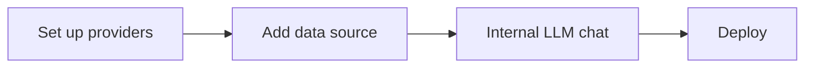
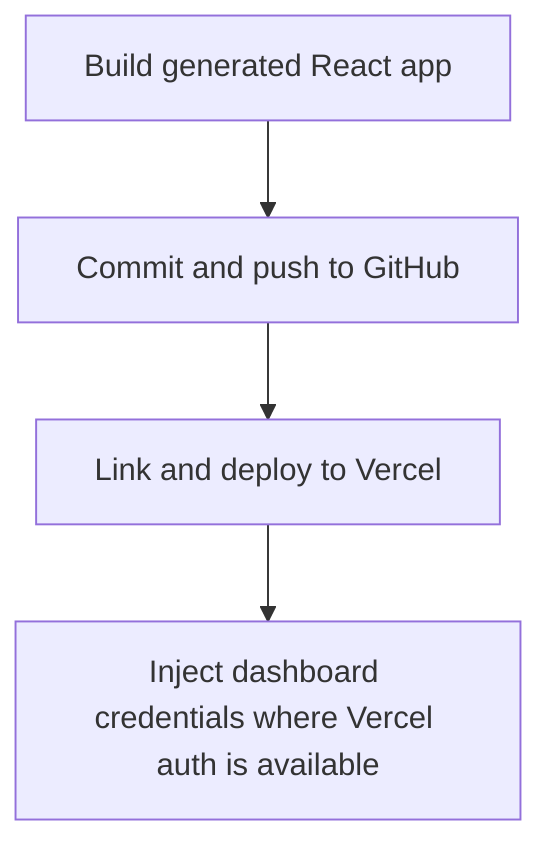

# OpenBoard User Manual

This manual is for humans using the OpenBoard terminal UI.

## What OpenBoard Does

OpenBoard turns CSV/JSON data into a deployed analytics app. It creates one shared React app called the OpenBoard workspace. Each dashboard you add becomes a tab in that app.

The workflow is:



## Launch

Install from npm (the package is `openboard-cli`; the command is `openboard`):

```bash
npm install -g openboard-cli
openboard
```

From source:

```bash
npm install
npm run build
node dist/index.js start
```

`openboard --version` shows the OpenBoard banner. `openboard --help` shows CLI commands.

## Main Menu

The TUI opens with:

```text
╔═══════════════════════════════════════╗
║        [_-_] O p e n B o a r d        ║
║     Analytics Dashboard Generator     ║
║                v1.0.7                 ║
╚═══════════════════════════════════════╝
```

Menu options:

- LLM Setup
- Dashboards
- Settings
- Exit

## First-Time Setup

Run LLM Setup and configure:

1. LLM provider
2. GitHub token
3. Vercel token
4. Dashboard login credentials

Supported LLM providers:

- OpenAI API key
- OpenAI Codex / ChatGPT subscription through browser/device login
- Anthropic
- Moonshot
- Ollama

Settings can be changed later from Settings.

## Create A Dashboard

1. Open Dashboards.
2. Select Add new dashboard to UI.
3. Choose preset: Health, Finance, Grocery, or Custom.
4. Enter a CSV/JSON file path.
5. Enter dashboard name.
6. Confirm after data analysis.
7. OpenBoard enters the internal LLM chat.

For a newly configured dashboard, the chat header shows:

```text
New Dashboard (<configured LLM>)
Internal LLM chat for dashboard creation
<static remark>
```

OpenBoard auto-generates the first dashboard from your data only on this first creation flow.

## Modify An Existing Dashboard

1. Open Dashboards.
2. Select Modify: `<dashboard title>`.

Modifying an existing dashboard does not regenerate the UI from scratch. It opens the internal chat so you can ask for changes.

The chat header shows:

```text
<dashboard title> (<configured LLM>)
Internal LLM chat for dashboard creation
<static remark>
```

## Internal Chat

Chat roles:

| Label | Meaning |
|---|---|
| `You` | Your message |
| `LLM` | Model response |
| `Sys` | OpenBoard system/status message |
| `Err` | Error |

The first system message is:

```text
Sys: Type a message to generate components or use slash commands (/help for list)
```

While the LLM is working, OpenBoard shows a compact spinner and a sarcastic loading line. The loading line changes every 10 seconds.

## Chat Commands

Commands must start with `/`.

| Command | Action |
|---|---|
| `/deploy` | Build, push to GitHub, and deploy to Vercel |
| `/push` | Commit and push to GitHub only |
| `/preview` | Start or restart local preview |
| `/build` | Build generated app |
| `/update` | Regenerate from latest linked data using saved prompt history, then build/push/deploy |
| `/data` | Show linked data source summary |
| `/history` | Show prompt history |
| `/logs` | Show latest operation log |
| `/doctor` | Check LLM/GitHub/Vercel/project readiness |
| `/status` | Show dashboard/project status |
| `/config` | Open settings |
| `/commands` | Show command palette |
| `/help` | Show command help |

When you start typing `/`, OpenBoard shows matching command suggestions with color coding.

## Deploy

In chat:

```text
You: /deploy
Sys: This will deploy <projectDir> to production. Type "yes" to confirm or anything else to cancel.
You: yes
Sys: Confirmed. Starting full deploy pipeline...
```

The deploy pipeline:



1. Build generated React app.
2. Commit and push to GitHub.
3. Link/deploy to Vercel.
4. Inject dashboard credentials where Vercel auth is available.

If GitHub push succeeds but local Vercel CLI auth is unavailable, Vercel Git integration may still deploy the pushed commit.

## Update From Latest Data

Use `/update` when the linked CSV/JSON file changed and you want the same dashboard intent rebuilt from prompt history.

```text
You: /update
```

OpenBoard reads the linked data file, uses saved prompt history, asks the LLM to update the dashboard tab, then builds, pushes, and deploys.

## Dashboard List

The Dashboards menu lets you:

- Add new dashboard to UI
- Open existing dashboard chat
- Remove dashboard
- Refresh list

Removing a dashboard runs a full cleanup so the deployed app matches the registry:

1. Asks the configured LLM to remove its tab/imports/content from `src/App.tsx`.
2. Deletes the dashboard's orphaned component files that no remaining dashboard uses.
3. Deletes the dashboard's protected API data (`api/_data/<slug>.json` and its entry in the shared data module).
4. Removes it from the OpenBoard registry and removes its local prompt-history file.
5. Rebuilds, pushes, and deploys so the live app no longer shows the dashboard.

If code cleanup fails, the dashboard is left registered so the live app is never left half-removed. Removal needs the configured LLM (for the App.tsx edit) and the same GitHub/Vercel auth as deploy.

## Settings

Settings supports:

- Update LLM provider
- Re-enter GitHub token
- Re-enter Vercel token
- Reset dashboard login
- Run full setup wizard

Use Settings when tokens cannot be decrypted or external auth fails.

## Files OpenBoard Uses

```text
~/.openboard/config.json
~/.openboard/prompt-history/<dashboard-id>.json
projects/openboard-app-workspace-<id>/
```

Do not manually edit encrypted config values. Re-enter tokens through Settings.

## Non-Interactive Commands

For automation, see [Agent.md](./Agent.md).

Common commands:

```bash
openboard agent create --data ./data.csv --name "Sales"
openboard agent update --dashboard sales --prompt "Add a monthly revenue trend"
openboard update --dashboard sales
openboard update --all
openboard rollback --dashboard sales
```

## Troubleshooting

### LLM not configured

Open Settings or LLM Setup and configure a provider.

### Vercel token cannot be decrypted

Re-enter the Vercel token in Settings. If you rely on Git integration, confirm deployment in the Vercel dashboard.

### GitHub author blocked by Vercel

OpenBoard repairs `openboard@local` commits by using the saved GitHub username or token identity before pushing.

### Dashboard did not update

Check:

- `/history` has entries.
- `/data` can read the linked file.
- `/doctor` reports LLM/GitHub/Vercel readiness.

### Build failed

Try a smaller prompt or ask the LLM to simplify the dashboard. OpenBoard also runs pre-deploy checks to relax common generated-code build blockers.

## Verification Commands

```bash
npm run lint
npm run test:run -- tests\phase4\command-parsing.test.ts
npm run build
```
