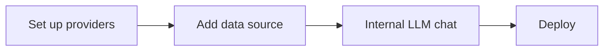
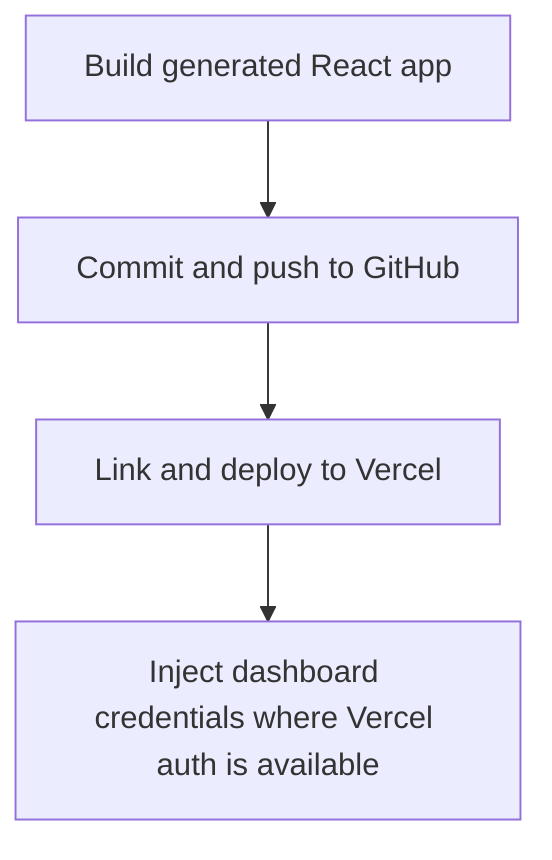

# OpenBoard User Manual

This manual is for humans using the OpenBoard terminal UI.

## What OpenBoard Does

OpenBoard turns CSV/Excel/JSON data into a deployed analytics app. It creates one shared React app called the OpenBoard workspace. Each dashboard you add becomes a tab in that app; tab composition is managed by OpenBoard itself, so one change can never break another dashboard's tab.

The workflow is:


```mermaid
flowchart LR
    A[Set up providers] --> B[Add data source] --> C[Internal LLM chat] --> D[Deploy]
```

## Launch

Install from npm (the package is `openboard-cli`; the command is `openboard`):

```bash
npm install -g openboard-cli
openboard
```

From source:

```bash
npm install
npm run build
node dist/index.js start
```

`openboard --version` shows the OpenBoard banner. `openboard --help` shows CLI commands.

## Main Menu

The TUI opens with:

```text
╔═══════════════════════════════════════╗
║        [_-_] O p e n B o a r d        ║
║     Analytics Dashboard Generator     ║
║                v1.5.2                 ║
╚═══════════════════════════════════════╝
```

Menu options:

- Setup (shown as "Get started — set up OpenBoard" until you configure an LLM)
- Dashboards
- Settings
- Exit

Until setup has run, the mode line reads "not configured yet — run Setup to choose one".

## First-Time Setup

On a fresh install `openboard` opens the setup wizard automatically — you don't
have to find it in the menu. Inside the wizard, **ESC or "← Go Back" steps back
one screen** (from the first screen it returns to the menu), so a wrong choice
never means restarting.

The setup wizard asks for your **mode first**, so you know from the beginning
what you will get at the end — and what leaves your machine:

1. **Local only** — local LLM (Ollama or LM Studio) + local preview only. Nothing leaves
   your machine: no cloud LLM, no GitHub, no Vercel.
2. **Hybrid** — cloud LLM (Codex/Claude/GPT/…) + local preview only. Prompts
   and data summaries go to your LLM provider; no GitHub push, no live
   deployment.
3. **All remote** — cloud LLM + GitHub + a live Vercel web app.

Privacy-conscious users should pick Local only or Hybrid; the deploy/push
features simply do not exist in those modes.

After the mode, the wizard walks through the steps that apply:

1. LLM provider (Local only mode offers Ollama and LM Studio)
2. GitHub token *(All remote mode only)*
3. Vercel token *(All remote mode only)*
4. Dashboard login credentials

Supported LLM providers:

- OpenAI API key
- OpenAI Codex / ChatGPT subscription through browser/device login
- Anthropic
- Google Gemini (AI Studio API key)
- Moonshot
- xAI (Grok)
- Mistral AI
- OpenRouter (models from multiple leading organizations)
- Ollama (local model library and runtime)
- LM Studio (local OpenAI-compatible server; start it from the Developer tab)

Each provider shows eight recent text/code model choices. The catalog was
reviewed against provider documentation on July 18, 2026; actual availability
can still vary by API account, plan, and region.

The mode and every setting can be changed later from Settings (Settings > App
mode). Switching to All remote later asks for GitHub/Vercel tokens; switching
to Local only requires either the Ollama or LM Studio provider.

## Create A Dashboard

1. Open Dashboards.
2. Select Add new dashboard.
3. Choose a preset: Health, Finance, Grocery, Travel, Food, Shopping, Subscriptions, Utilities, Invoices, or Custom.
4. Enter a CSV/XLSX/JSON file path.
5. Enter the dashboard name.
6. Confirm after data analysis.
7. OpenBoard enters the internal LLM chat.

If no LLM is configured yet, step 1 shows a warning up front pointing to Setup.
If the data file can't be read or the name is invalid, ESC returns you to that
field with your input preserved — you never restart from the preset step.

For a newly configured dashboard, the chat header shows:

```text
New Dashboard
LLM - <provider> · <model> · effort: <level> · Mode: <app mode>
Chat to create or modify this dashboard
```

OpenBoard auto-generates the first dashboard from your data only on this first creation flow.

## Modify An Existing Dashboard

1. Open Dashboards.
2. Select Modify: `<dashboard title>`.

Modifying an existing dashboard does not regenerate the UI from scratch. It opens the internal chat so you can ask for changes.

The chat header shows the dashboard title with the same LLM/model/effort/mode
line as above.

## Internal Chat

Chat roles:

| Label | Meaning |
|---|---|
| `You` | Your message (green) |
| `LLM` | Model response (yellow) |
| `Sys` | OpenBoard system/status message (cyan — informational, never an error) |
| `Err` | Error (red — the only red messages) |

Errors are always shown in plain, actionable language — a bad API key,
unreachable local server, unsupported model setting, or exhausted quota each get
a specific hint. Raw provider error text never appears as a model reply.

The first system message is:

```text
Sys: Type a message to generate components or use slash commands (/help for list)
```

While waiting for the first response token, OpenBoard shows a compact spinner and a playful loading line (rotates every 10 seconds). Once the model starts streaming — or a build/deploy pipeline starts — a single elapsed-time/progress indicator takes over. Pipeline steps are numbered against the running operation (a plain `/build` shows `[1/1] Building project`).

## Chat Commands

Commands must start with `/`.

| Command | Action |
|---|---|
| `/deploy` | Build, push to GitHub, and deploy to Vercel |
| `/push` | Commit and push to GitHub only |
| `/preview` | Start or restart local preview |
| `/build` | Build generated app |
| `/update` | Regenerate from latest linked data using saved prompt history, then build/push/deploy |
| `/data` | Show linked data source summary |
| `/history` | Show prompt history |
| `/logs` | Show latest operation log |
| `/doctor` | Check LLM/GitHub/Vercel/project readiness |
| `/model` | Show or switch the LLM model and effort |
| `/status` | Show dashboard/project status |
| `/config` | Open settings |
| `/commands` | Show command palette |
| `/help` | Show command help |

When you start typing `/`, OpenBoard shows matching command suggestions with color coding.

## Deploy

In chat:

```text
You: /deploy
Sys: This will deploy <projectDir> to production. Type "yes" to confirm or anything else to cancel.
You: yes
Sys: Confirmed. Starting full deploy pipeline...
```

The deploy pipeline:


```mermaid
flowchart TD
    A[Build generated React app] --> B[Commit and push to GitHub]
    B --> C[Link and deploy to Vercel]
    C --> D[Inject dashboard credentials where Vercel auth is available]
```

1. Build generated React app.
2. Commit and push to GitHub.
3. Link/deploy to Vercel.
4. Inject dashboard credentials where Vercel auth is available.

If GitHub push succeeds but local Vercel CLI auth is unavailable, Vercel Git integration may still deploy the pushed commit.

## Update From Latest Data

Use `/update` when the linked CSV/JSON file changed and you want the same dashboard intent rebuilt from prompt history.

```text
You: /update
```

OpenBoard reads the linked data file, uses saved prompt history, asks the LLM to update the dashboard tab, then builds, pushes, and deploys.

## Dashboard List

The Dashboards menu lets you:

- Add new dashboard
- Open existing dashboard chat
- Modify all / Regenerate all / Remove all (bulk actions)
- Remove dashboard
- Refresh list

Removing a dashboard runs a full cleanup so the deployed app matches the registry:

1. Deterministically removes its tab from OpenBoard's dashboard manifest (no LLM involved).
2. Deletes the dashboard's orphaned component files that no remaining dashboard uses.
3. Deletes the dashboard's protected API data (`api/_data/<slug>.json` and its entry in the shared data module).
4. Removes it from the OpenBoard registry and removes its local prompt-history file.
5. Refreshes the master Overview tab, then rebuilds (and pushes/deploys in All remote mode).

If code cleanup fails, the dashboard is left registered so the live app is never left half-removed. Removing the last dashboard restores the empty starter app.

## Settings

Settings supports:

- Update LLM provider
- Re-enter GitHub token
- Re-enter Vercel token
- Reset dashboard login
- Run full setup wizard

Use Settings when tokens cannot be decrypted or external auth fails.

## Files OpenBoard Uses

```text
~/.openboard/config.json
~/.openboard/prompt-history/<dashboard-id>.json
projects/openboard-app-workspace-<id>/
```

Do not manually edit encrypted config values. Re-enter tokens through Settings.

## Non-Interactive Commands

For automation, see [Agent.md](./Agent.md).

Common commands:

```bash
openboard agent create --data ./data.csv --name "Sales"
openboard agent update --dashboard sales --prompt "Add a monthly revenue trend"
openboard update --dashboard sales
openboard update --all
openboard rollback --dashboard sales
```

## Troubleshooting

### LLM not configured

Open Settings or LLM Setup and configure a provider.

### Vercel token cannot be decrypted

Re-enter the Vercel token in Settings. If you rely on Git integration, confirm deployment in the Vercel dashboard.

### GitHub author blocked by Vercel

OpenBoard repairs `openboard@local` commits by using the saved GitHub username or token identity before pushing.

### Dashboard did not update

Check:

- `/history` has entries.
- `/data` can read the linked file.
- `/doctor` reports LLM/GitHub/Vercel readiness.

### Build failed

Try a smaller prompt or ask the LLM to simplify the dashboard. OpenBoard also runs pre-deploy checks to relax common generated-code build blockers.

## Verification Commands

```bash
npm run lint
npm run test:run -- tests\phase4\command-parsing.test.ts
npm run build
```
