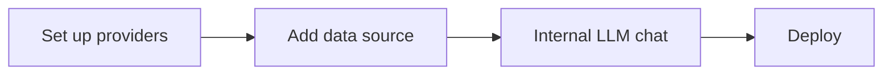
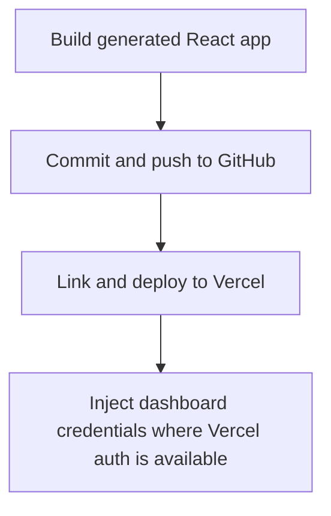

# OpenBoardCLI User Manual

This manual is for humans using the OpenBoardCLI terminal UI.

## What OpenBoardCLI Does

OpenBoardCLI turns CSV/Excel/JSON data into a deployed analytics app. It creates one shared React app called the OpenBoardCLI workspace. Each dashboard you add becomes a tab in that app; tab composition is managed by OpenBoardCLI itself, so one change can never break another dashboard's tab.

The workflow is:


```mermaid
flowchart LR
    A[Set up providers] --> B[Add data source] --> C[Internal LLM chat] --> D[Deploy]
```

## Launch

Install from npm (the package is `openboard-cli`; the command is `openboard`):

```bash
npm install -g openboard-cli
openboard
```

From source:

```bash
npm install
npm run build
node dist/index.js start
```

`openboard --version` shows the OpenBoardCLI banner. `openboard --help` shows CLI commands.

## Main Menu

The TUI opens with:

```text
╔═══════════════════════════════════════╗
║           [>_] OpenBoardCLI           ║
║     Analytics Dashboard Generator     ║
║                v2.2.0                 ║
╚═══════════════════════════════════════╝
```

Menu options, in order:

1. **Onboarding** — connect an LLM and choose what leaves your machine
   (shown as "Onboarding — start here" until you configure an LLM)
2. **Integrations** — where your data comes from
3. **Dashboards** — create, modify and regenerate dashboards
4. **Settings** — mode, provider and credentials
5. **Exit**

Below the banner a dim line states the facts: your mode and provider, or
"not configured yet" before onboarding has run. Moving the cursor shows a
one-line description of the highlighted option.

Every screen shares the same shell: a breadcrumb title, one line of facts, the
options, one line describing the highlighted option, and a key hint strip
(`↑↓ move · ⏎ select · esc back`). Those hints are worded identically
everywhere in the TUI.

## First-Time Setup

On a fresh install `openboard` opens the setup wizard automatically — you don't
have to find it in the menu. Inside the wizard, **ESC or "← Go Back" steps back
one screen** (from the first screen it returns to the menu), so a wrong choice
never means restarting.

The setup wizard asks for your **mode first**, so you know from the beginning
what you will get at the end — and what leaves your machine:

1. **Local only** — local LLM (Ollama or LM Studio) + local preview only. Nothing leaves
   your machine: no cloud LLM, no GitHub, no Vercel.
2. **Hybrid (local LLM)** — local LLM (Ollama or LM Studio) + GitHub + a live
   Vercel web app. Generation stays on your machine — no prompts or data
   summaries reach an LLM provider — and only the built dashboard and its data
   are published. Pick this when you want a URL you can open on your phone but
   your data must never reach an LLM vendor.
3. **Hybrid (cloud LLM)** — cloud LLM (Codex/Claude/GPT/…) + local preview only.
   Prompts and data summaries go to your LLM provider; no GitHub push, no live
   deployment.
4. **All remote** — cloud LLM + GitHub + a live Vercel web app.

The two axes are independent: modes 1 and 2 keep generation on your machine,
modes 1 and 3 publish nothing. Deploy/push simply do not exist in modes 1 and 3,
and the cloud providers are not offered in modes 1 and 2.

After the mode, the wizard walks through the steps that apply:

1. LLM provider (the local-LLM modes offer Ollama and LM Studio; the cloud modes
   offer the cloud providers)
2. GitHub token *(the deploying modes only)*
3. Vercel token *(the deploying modes only)*
4. Dashboard login credentials

Supported LLM providers:

- OpenAI API key
- OpenAI Codex / ChatGPT subscription through browser/device login
- Anthropic
- Google Gemini (AI Studio API key)
- Moonshot
- xAI (Grok)
- Mistral AI
- OpenRouter (models from multiple leading organizations)
- Ollama (local model library and runtime)
- LM Studio (local OpenAI-compatible server; start it from the Developer tab)

Ollama and LM Studio show your actual installed/loaded models, fetched live
from the local server; if that lookup fails, they fall back to a static
catalog of eight recent choices. Other providers always show that static
catalog. It was reviewed against provider documentation on July 18, 2026;
actual availability can still vary by API account, plan, and region.

The mode and every setting can be changed later from Settings (Settings > App
mode). Switching to a deploying mode later asks for GitHub/Vercel tokens;
switching to a local-LLM mode requires either the Ollama or LM Studio provider.
If your configured provider does not fit the new mode, Settings says so and
names the mode that does fit — for example, All remote with Ollama configured
points you at Hybrid (local LLM), which is the same setup with the provider
allowed.

## Create A Dashboard

1. Open Dashboards.
2. Select Add new dashboard.
3. Choose a preset: Health, Finance, Grocery, Travel, Food, Shopping, Subscriptions, Utilities, Invoices, or Custom.
4. Choose UI complexity: **High quality** (default, full-featured) or **Low quality**
   (lightweight — recommended for local/small-context models). Low is
   pre-highlighted when your configured provider is Ollama or LM Studio.
5. Enter a CSV/XLSX/JSON file path. Pasted paths may be surrounded by quotes (e.g. Windows Explorer's "Copy as path") — they're stripped automatically.
6. Enter the dashboard name.
7. Confirm after data analysis.
8. OpenBoardCLI enters the internal LLM chat.

If no LLM is configured yet, step 1 shows a warning up front pointing to Setup.
If the data file can't be read or the name is invalid, ESC returns you to that
field with your input preserved — you never restart from the preset step.

Low quality boards use a shorter system prompt and a smaller completion
budget for every generation and update, not just the first one — this applies
on every `/update` too, so a low-context local model doesn't hit the same
wall again later. A Low quality dashboard only requires a header, 1-3 KPI
cards, and one chart; a High quality one also requires Top Insights, a
trend chart, and a searchable/sortable records table.

For a newly configured dashboard, the chat header shows:

```text
New Dashboard
LLM - <provider> · <model> · effort: <level> · Mode: <app mode>
Chat to create or modify this dashboard
```

OpenBoardCLI auto-generates the first dashboard from your data only on this first creation flow.

## Modify An Existing Dashboard

1. Open Dashboards.
2. Select Modify: `<dashboard title>`.

Modifying an existing dashboard does not regenerate the UI from scratch. It opens the internal chat so you can ask for changes.

The chat header shows the dashboard title with the same LLM/model/effort/mode
line as above.

## Internal Chat

Chat roles:

| Label | Meaning |
|---|---|
| `You` | Your message (green) |
| `LLM` | Model response (yellow) |
| `Sys` | OpenBoardCLI system/status message (cyan — informational, never an error) |
| `Err` | Error (red — the only red messages) |

Errors are always shown in plain, actionable language — a bad API key,
unreachable local server, unsupported model setting, or exhausted quota each get
a specific hint. Raw provider error text never appears as a model reply.

The first system message is:

```text
Sys: Type a message to generate components or use slash commands (/help for list)
```

While waiting for the first response token, OpenBoardCLI shows a compact spinner and a playful loading line (rotates every 10 seconds). Once the model starts streaming — or a build/deploy pipeline starts — a single elapsed-time/progress indicator takes over. Pipeline steps are numbered against the running operation (a plain `/build` shows `[1/1] Building project`).

## Chat Commands

Commands must start with `/`.

| Command | Action |
|---|---|
| `/deploy` | Build, push to GitHub, and deploy to Vercel |
| `/push` | Commit and push to GitHub only |
| `/preview` | Start or restart local preview |
| `/build` | Build generated app |
| `/update` | Regenerate from latest linked data using saved prompt history, then build/push/deploy |
| `/data` | Show linked data source summary |
| `/history` | Show prompt history |
| `/logs` | Show latest operation log |
| `/billers` | Invoice fetcher status; `/billers sync` runs them; `/billers enable\|disable <key>` toggles one |
| `/doctor` | Check LLM/GitHub/Vercel/project readiness |
| `/model` | Show or switch the LLM model and effort |
| `/stop` | Cancel the current in-flight operation (generation, build, push, or deploy) |
| `/resume` | Resume the latest interrupted/failed run for this dashboard |
| `/status` | Show dashboard/project status |
| `/config` | Open settings |
| `/commands` | Show command palette |
| `/help` | Show command help |

When you start typing `/`, OpenBoardCLI shows matching command suggestions with color coding.

## Deploy

In chat:

```text
You: /deploy
Sys: This will deploy <projectDir> to production. Type "yes" to confirm or anything else to cancel.
You: yes
Sys: Confirmed. Starting full deploy pipeline...
```

The deploy pipeline:


```mermaid
flowchart TD
    A[Build generated React app] --> B[Commit and push to GitHub]
    B --> C[Link and deploy to Vercel]
    C --> D[Inject dashboard credentials where Vercel auth is available]
```

1. Build generated React app.
2. Commit and push to GitHub.
3. Link/deploy to Vercel.
4. Inject dashboard credentials where Vercel auth is available.

If GitHub push succeeds but local Vercel CLI auth is unavailable, Vercel Git integration may still deploy the pushed commit.

## Update From Latest Data

Use `/update` when the linked CSV/JSON file changed and you want the same dashboard intent rebuilt from prompt history.

```text
You: /update
```

OpenBoardCLI reads the linked data file, uses saved prompt history, asks the LLM to update the dashboard tab, then builds, pushes, and deploys.

## Dashboard List

The Dashboards menu lets you:

- Add new dashboard
- Open existing dashboard chat
- Modify all / Regenerate all / Remove all (bulk actions)
- Remove dashboard
- Refresh list

Removing a dashboard runs a full cleanup so the deployed app matches the registry:

1. Deterministically removes its tab from OpenBoardCLI's dashboard manifest (no LLM involved).
2. Deletes the dashboard's orphaned component files that no remaining dashboard uses.
3. Deletes the dashboard's protected API data (`api/_data/<slug>.json` and its entry in the shared data module).
4. Removes it from the OpenBoardCLI registry and removes its local prompt-history file.
5. Refreshes the master Overview tab, then rebuilds (and pushes/deploys in the deploying modes).

If code cleanup fails, the dashboard is left registered so the live app is never left half-removed. Removing the last dashboard restores the empty starter app.

## Integrations

Integrations is where your data comes from. It lists each connected source and
its state at a glance:

- **Gmail** — per-biller invoice scripts, schedule, enable/disable

Selecting Gmail opens everything described below. GitHub and Vercel are not
integrations in this sense — they are deploy targets, and stay under Settings.

## Settings

Settings supports:

- App mode
- LLM provider
- GitHub token *(the deploying modes only)*
- Vercel token *(the deploying modes only)*
- Dashboard login
- Re-run onboarding

Use Settings when tokens cannot be decrypted or external auth fails.

## Integrations → Gmail

Turn invoice emails into per-biller spending dashboards. OpenBoardCLI ships
ready-made fetchers for **Amazon, Amazon Pay, Rapido, Swiggy Food, Swiggy
Instamart, Uber, Urban Company and Zomato**, and will drive any
`fetch_<biller>.py` you write yourself. Each one reads Gmail over IMAP and
appends rows to `data/invoices/<biller>.csv`; OpenBoardCLI enables them, runs them
on a schedule, and turns each biller's invoices into its own dashboard.

The quickest start is **Install the fetchers bundled with OpenBoardCLI**, offered
as the first option when nothing is set up yet. It copies them into the folder
below and configures the path in one step. Running it again only adds fetchers
that are missing — anything you have edited is left untouched.

**Where to keep everything.** OpenBoardCLI suggests — and pre-fills — one canonical
layout, so the scripts, your invoice data, and the credentials they need all sit
together under OpenBoardCLI's own folder:

```text
~/.openboard/billers/
  scripts/invoice_fetchers/     your fetch_<biller>.py files  ← this is the folder you configure
                                plus probe_biller.py and parse_sample.py (helpers Biller Studio uses)
  data/invoices/                <biller>.csv — one per biller, appended over time
    raw/<biller>/state.json     which emails were already imported
```

The depth matters: the scripts locate their own data two folders above
themselves, so this layout works with them unmodified. You can point elsewhere
if you already keep them somewhere, but that folder must have the same
`scripts/<anything>/` shape.

Integrations → Gmail, in this order:

0. **Install the fetchers bundled with OpenBoardCLI** — offered first when nothing
   is configured. Skip this only if you keep your own scripts elsewhere.
1. **Invoice scripts folder** — the folder holding your `fetch_*.py` files (paste
   with or without quotes). OpenBoardCLI reads each script's own `KEY` and
   `DISPLAY_NAME` constants to build the biller list, so nothing is hardcoded and
   `fetch_pending_invoices.py` / `run_backfill_invoices_new.py` are ignored (they
   are not per-biller fetchers).
2. **Gmail address** — the account the fetchers log into. Asked before any
   credential, so you always know which account you are about to authorize.
3. **Gmail App Password** — a 16-character App Password from
   myaccount.google.com/apppasswords, *not* your normal Gmail password. It is
   stored encrypted and handed to each fetcher through its process environment
   at run time; nothing is written to disk.
4. **The biller list** appears — one row per discovered biller with a `[x]`/`[ ]`
   toggle. Select a row to switch that biller on or off. Come back and change it
   any time.
5. **Fetch interval** — one shared schedule for every enabled biller (default 360
   min / 6h), shown and editable right in the list. **Fetch now** runs the enabled
   ones immediately. **Rescan folder** picks up newly added scripts.
6. **Stop fetch** replaces "Fetch now" while a fetch is in flight, and can stop a
   scheduled run as well as one you started. The biller currently running is
   terminated; billers already finished keep their invoices, and the schedule
   stays anchored so stopping does not cause a full re-fetch next time.

Fetching runs in-process, only while OpenBoardCLI is open — no background daemon. The
meta line reads `fetching now` during a run and `next in …` otherwise. The last run
time is remembered between sessions, so reopening OpenBoardCLI does not re-fetch
everything; an overdue run starts shortly after launch.

The schedule is anchored when a run **starts**, not when it finishes. A fetch across
many billers takes minutes, and quitting OpenBoardCLI part-way used to discard the
record of work that had already happened — so the next launch found the schedule
overdue and fetched everything again.

After each biller runs, OpenBoardCLI compares its CSV before and after. New invoices
refresh that biller's dashboard (using the closest category preset — Zomato and
Swiggy become Food, Uber and Rapido become Travel, Amazon becomes Shopping). If a
biller has data but no dashboard yet — common when you bring an existing CSV with
you — the first run builds one from what is already on disk instead of waiting for
new mail that may never arrive. Nothing new *and* a dashboard already there means
it stops, with no LLM call.

Scheduled runs happen with no screen open, so their output goes to a shared
**fetch log** at the bottom of this screen. Reopen it later and the recent history
is still there; PgUp/PgDn scroll it.

### Add your own biller (Biller Studio)

The eight bundled fetchers will not cover your billers. Choose **`✚ Add a new
biller (Biller Studio)`** and OpenBoardCLI writes one for you.

1. **Sender address** — where those receipts come from, e.g. `noreply@bigbasket.com`.
2. **Subject contains** — a fragment that separates receipts from marketing mail,
   e.g. `Your order`. Enter `-` to match every email from that sender.
3. OpenBoardCLI finds one real matching email and **shows you the exact text** it
   wants to send to your LLM provider, with the character count. Nothing leaves
   your machine until you type `yes`.
4. It lists the fields it can extract, each with the value it found, so you can
   check them against the email in front of you. Type `yes` to build.
5. It writes the fetcher, compiles it, checks how much it actually extracts, and
   **dry-runs it against your mailbox**. Anything that fails is fed back and
   retried up to twice. Only then is it saved.
6. The new biller appears in the list, already enabled.

Receipts that arrive as **PDF attachments** work too — the probe reads them with
`pdfplumber` and builds from the PDF-reading skeleton.

Commands while in the Studio: `/probe` (search again), `/fields` (show detected
fields), `/script` (show the generated code), `/restart`, `/cancel`, `/help`.

If a CSV in your invoices folder has no fetcher behind it, the settings screen
says so in yellow — that dashboard renders but will never update.

**Security worth knowing.** Your App Password is stored encrypted and passed to
each fetcher through its process environment at run time; it is never written to
disk. An App Password grants full mailbox read access — revoke it in your Google
account to cut access off. Generated fetchers are scanned before they are saved:
a fetcher reads mail and writes a CSV, so anything reaching for the network, a
subprocess or `eval` is refused, because the sample email is text somebody else
wrote. Fetchers need **Python 3 with `beautifulsoup4`** (plus `pdfplumber` for
PDF billers).

## Files OpenBoardCLI Uses

```text
~/.openboard/config.json
~/.openboard/prompt-history/<dashboard-id>.json
projects/openboard-app-workspace-<id>/
```

When invoice fetchers are configured, these live next to your scripts folder
(two levels above it, where the scripts themselves expect them):

```text
<repo>/secrets/gmail_app_credentials.json   (written by OpenBoardCLI, plain text)
<repo>/data/invoices/<biller>.csv           (written by each fetcher)
<repo>/data/invoices/raw/<biller>/          (raw mail + per-biller dedup state)
```

Do not manually edit encrypted config values. Re-enter tokens through Settings.

## Non-Interactive Commands

For automation, see [Agent.md](./Agent.md).

Common commands:

```bash
openboard agent create --data ./data.csv --name "Sales"
openboard agent update --dashboard sales --prompt "Add a monthly revenue trend"
openboard update --dashboard sales
openboard update --all
openboard rollback --dashboard sales
```

## Troubleshooting

### LLM not configured

Open Settings or LLM Setup and configure a provider.

### Vercel token cannot be decrypted

Re-enter the Vercel token in Settings. If you rely on Git integration, confirm deployment in the Vercel dashboard.

### GitHub author blocked by Vercel

OpenBoardCLI repairs `openboard@local` commits by using the saved GitHub username or token identity before pushing.

### Dashboard did not update

Check:

- `/history` has entries.
- `/data` can read the linked file.
- `/doctor` reports LLM/GitHub/Vercel readiness.

### Build failed

Try a smaller prompt or ask the LLM to simplify the dashboard. OpenBoardCLI also runs pre-deploy checks to relax common generated-code build blockers. If every automatic repair attempt returns no code at all, the error explains this directly — it usually means a local "thinking" model spent its whole response budget on internal reasoning. Switch that dashboard to Low quality (or a smaller/non-reasoning local model), or increase the model's max output tokens in your local server settings.

### A dashboard tab shows "failed to load"

Each tab has its own error boundary, so a crash in one tab's generated code never blanks the rest of the app. Switch away and back to retry the render, or send a chat message (or `/update`) asking the LLM to fix the reported error.

### A generation, build, push, or deploy seems stuck

Type `/stop` to cancel it. If it left the dashboard in a partially-finished state (e.g. build/push/deploy failed after generation succeeded), `/resume` picks the latest interrupted run back up — no LLM cost for the parts that already succeeded.

## Verification Commands

```bash
npm run lint
npm run test:run -- tests\phase4\command-parsing.test.ts
npm run build
```
